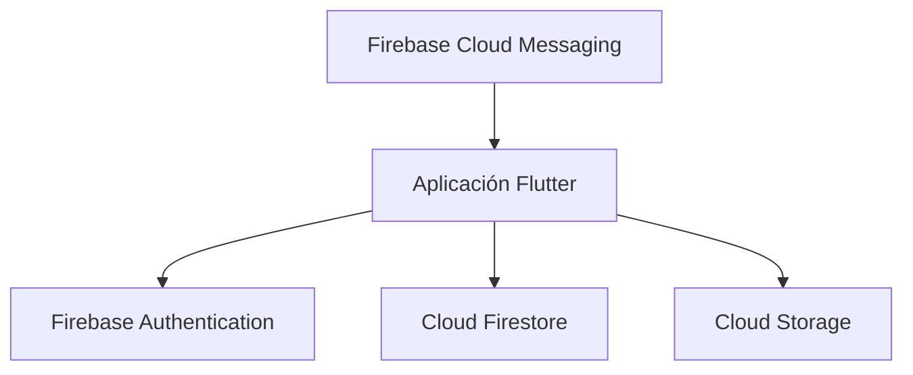

# GameVault Mobile

Aplicación móvil para gestionar una biblioteca personal de videojuegos mediante tecnologías Mobile y servicios Cloud.

> Proyecto académico de la asignatura Mobile Cloud Computing.

## Equipo de trabajo

| Integrante          | Usuario de GitHub                        | Responsabilidad inicial                                              |
| ------------------- | ---------------------------------------- | -------------------------------------------------------------------- |
| Santiago Piedrahita | [@santkd16](https://github.com/santkd16) | Desarrollo móvil, autenticación, biblioteca y funcionamiento offline |
| Jhon Vargas         | [@jhon9036](https://github.com/jhon9036) | Servicios cloud, gestión de juegos, sincronización y notificaciones  |

**Docente:** [@endijromero](https://github.com/endijromero)

## Visión del proyecto

GameVault Mobile busca convertirse en una solución móvil sencilla, segura y accesible para que los jugadores puedan organizar su colección de videojuegos desde cualquier lugar y dispositivo.

La aplicación permitirá centralizar la información de los juegos que una persona posee, está jugando, ha terminado o desea comprar. Los datos se almacenarán en la nube para mantener la información disponible y sincronizada.

## Problema identificado

Actualmente, muchas personas tienen videojuegos distribuidos entre diferentes plataformas como PC, PlayStation, Xbox, Nintendo y dispositivos móviles. Esto dificulta recordar qué juegos poseen, cuáles han terminado, cuáles están jugando y cuáles desean adquirir.

Las listas manuales, notas o archivos locales no siempre están disponibles desde otros dispositivos y pueden perderse si el equipo se daña o cambia. También presentan limitaciones para buscar, filtrar, actualizar y sincronizar la información.

## Solución propuesta

GameVault Mobile será una aplicación desarrollada con Flutter que permitirá:

* Registrar e iniciar sesión de forma segura.
* Crear una biblioteca personal de videojuegos.
* Agregar, editar y eliminar videojuegos.
* Clasificar los juegos por plataforma, categoría y estado.
* Consultar el detalle de cada videojuego.
* Escribir reseñas y puntuaciones personales.
* Crear una lista de deseos.
* Buscar y filtrar videojuegos.
* Sincronizar la información con servicios cloud.
* Consultar información guardada cuando no exista conexión.
* Recibir notificaciones relacionadas con la biblioteca.

Cada usuario administrará únicamente su propia información.

## Objetivo general

Desarrollar una aplicación móvil multiplataforma que permita gestionar una biblioteca personal de videojuegos, utilizando Flutter para la interfaz móvil y servicios cloud para la autenticación, persistencia, sincronización y disponibilidad de los datos.

## Objetivos específicos

* Diseñar una interfaz móvil clara, accesible y adaptable.
* Implementar autenticación segura de usuarios.
* Permitir la gestión completa de videojuegos personales.
* Almacenar y sincronizar la información en la nube.
* Implementar búsquedas, filtros, estados y listas de deseos.
* Permitir el acceso a información previamente guardada sin conexión.
* Aplicar una metodología ágil mediante GitHub Projects.

## Usuarios objetivo

La aplicación está dirigida a jugadores que poseen videojuegos en diferentes plataformas y necesitan una herramienta móvil para organizar su colección, progreso, reseñas y lista de deseos.

## Propuesta de valor

GameVault Mobile reúne en una sola aplicación la biblioteca de videojuegos del usuario y permite consultarla desde cualquier lugar. La combinación de Flutter y servicios cloud ofrece una experiencia multiplataforma, sincronizada, privada y disponible incluso cuando la conexión sea limitada.

## Alcance del producto mínimo viable

El producto mínimo viable incluirá:

1. Registro e inicio de sesión.
2. Perfil básico del usuario.
3. Biblioteca personal.
4. Creación, edición y eliminación de videojuegos.
5. Clasificación por estado y progreso.
6. Búsqueda y filtros.
7. Detalle, puntuación y reseña personal.
8. Lista de deseos.
9. Sincronización cloud.
10. Funcionamiento offline básico.
11. Notificaciones móviles.

## Arquitectura inicial

La aplicación Flutter se comunicará con los servicios de Firebase. Authentication administrará la identidad de los usuarios, Cloud Firestore almacenará la biblioteca y Cloud Storage permitirá guardar imágenes. Firebase Cloud Messaging enviará notificaciones a los dispositivos.

## Stack tecnológico

| Componente           | Tecnología               | Propósito                        |
| -------------------- | ------------------------ | -------------------------------- |
| Aplicación móvil     | Flutter                  | Desarrollo multiplataforma       |
| Lenguaje             | Dart                     | Lógica de la aplicación          |
| Diseño               | Material Design 3        | Componentes e interfaz móvil     |
| Autenticación        | Firebase Authentication  | Registro y acceso de usuarios    |
| Base de datos cloud  | Cloud Firestore          | Persistencia y sincronización    |
| Almacenamiento       | Cloud Storage            | Imágenes de perfiles y juegos    |
| Notificaciones       | Firebase Cloud Messaging | Notificaciones push              |
| Repositorio          | GitHub                   | Control de versiones             |
| Gestión ágil         | GitHub Projects          | Product Backlog y tablero Kanban |
| Integración continua | GitHub Actions           | Validaciones automáticas futuras |

## Product Backlog inicial

| ID    | Historia                             | Responsable | Prioridad | Estimación |
| ----- | ------------------------------------ | ----------- | --------- | ---------: |
| HU-01 | Registro e inicio de sesión          | @santkd16   | Alta      |          5 |
| HU-02 | Gestión del perfil                   | @jhon9036   | Media     |          3 |
| HU-03 | Visualización de la biblioteca       | @santkd16   | Alta      |          5 |
| HU-04 | Registro de videojuegos              | @jhon9036   | Alta      |          5 |
| HU-05 | Edición y eliminación de videojuegos | @santkd16   | Alta      |          5 |
| HU-06 | Estado y progreso de los videojuegos | @jhon9036   | Alta      |          3 |
| HU-07 | Búsqueda y filtros                   | @santkd16   | Media     |          3 |
| HU-08 | Detalle, puntuación y reseña         | @jhon9036   | Media     |          5 |
| HU-09 | Lista de deseos                      | @santkd16   | Media     |          5 |
| HU-10 | Sincronización de datos en la nube   | @jhon9036   | Alta      |          8 |
| HU-11 | Consulta de información sin conexión | @santkd16   | Alta      |          8 |
| HU-12 | Notificaciones móviles               | @jhon9036   | Media     |          5 |

Cada integrante tiene asignadas seis historias. Los criterios de aceptación se documentarán individualmente en las Issues del repositorio.

## Flujo del tablero Kanban

Las historias serán gestionadas mediante los siguientes estados:

* **Backlog:** historia identificada, pero todavía no seleccionada.
* **Ready:** historia analizada y disponible para comenzar.
* **In progress:** historia en desarrollo.
* **In review:** historia pendiente de revisión.
* **Done:** historia terminada y aceptada.

## Definición de terminado

Una historia podrá moverse a `Done` cuando:

* Cumpla sus tres criterios de aceptación.
* La funcionalidad haya sido revisada.
* No presente errores críticos conocidos.
* Los cambios estén documentados.
* La información se encuentre actualizada en GitHub Projects.

## Pitch del proyecto

GameVault Mobile es una aplicación móvil que permite a los jugadores organizar todos sus videojuegos desde un único lugar. El usuario podrá gestionar su biblioteca, progreso, reseñas y lista de deseos, incluso cuando tenga una conexión limitada. Flutter permitirá ofrecer una experiencia multiplataforma, mientras que Firebase proporcionará autenticación, almacenamiento, sincronización y notificaciones mediante servicios cloud.
